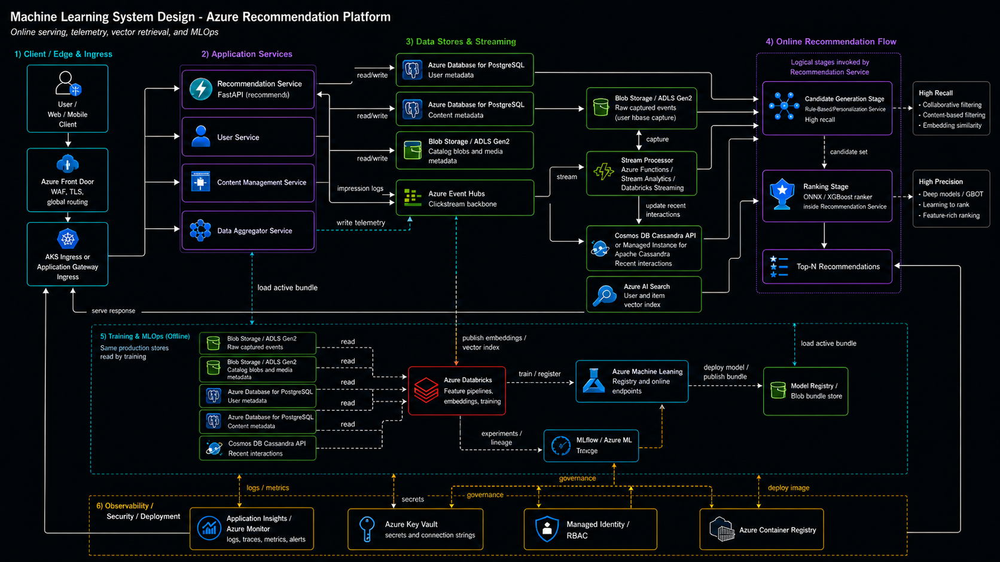
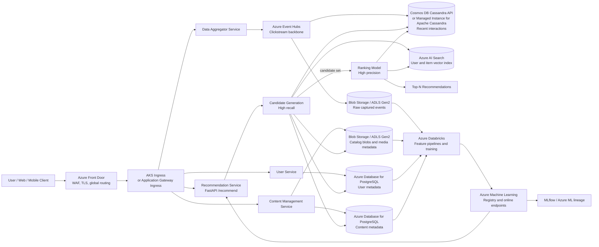

# Multistage Recsys Design

[Back to docs hub](README.md) | [Back to main README](../README.md)

This document expands the `Practical Azure Implementation` section in the main README. It translates the two-stage recommender shape in the reference diagram into an Azure-first production design, then maps that design back to this repo's current package-owned implementation.

## Current Repo Baseline

The project already behaves like a compact multistage recommender:

- `src/amazon_recsys/ml/core.py` owns the retrieval, candidate union, ranking, evaluation, and serving-time recommendation logic.
- Candidate generation combines popularity backfill, item-item cooccurrence, latent collaborative filtering, content-based retrieval, and an optional two-tower neural retriever.
- Ranking uses `xgboost` by default and keeps `dlrm` as an experimental backend.
- Bundle export writes a versioned ONNX-backed serving unit under `artifacts/amazon_recsys/bundles/`.
- `src/amazon_recsys/application/services.py` loads the active bundle, serves `/recommend`, and records inference events for monitoring.
- `src/amazon_recsys/monitoring/` computes batch feature drift and concept drift from served recommendations plus delayed outcomes.
- `infra/azure/` is currently a scaffold: Azure ML workspace, storage, Key Vault, and a basic AKS deployment shape. It is not yet the full production topology described below.

## Azure Logical Architecture

The target Azure structure follows the screenshot's flow: user traffic enters through an edge load-balancing layer, recommendation serving reads user/content/vector/interaction data, clickstream telemetry is written asynchronously, candidate generation optimizes recall, and ranking optimizes final precision.

## Request And Data Flow

1. A user opens the product surface and the backend calls the recommender through Azure Front Door.
2. Front Door terminates at the edge, applies WAF policy, and routes to AKS ingress or Application Gateway.
3. The Recommendation Service receives `user_id`, placement context, and optional cold-start history.
4. The service hydrates user context from PostgreSQL and recent behavior from the interaction store.
5. Candidate generation builds a high-recall set from cooccurrence, latent CF, content retrieval, vector retrieval, and popularity backfill.
6. Business filters remove unavailable, region-ineligible, language-ineligible, or already-seen items before ranking.
7. The ranker scores the candidate set with model features, embedding scores, metadata, and recent interaction signals.
8. The top items are returned synchronously to the application backend for page, feed, email, or widget rendering.
9. The recommendation event is logged asynchronously to Event Hubs and the local monitoring store abstraction.
10. Event Hubs Capture archives raw telemetry to Blob Storage or ADLS Gen2 for training, replay, and monitoring.

## Service Mapping

| Diagram component | Azure equivalent | Design note |
| --- | --- | --- |
| Customer-facing load balancer | Azure Front Door plus AKS ingress | Use Front Door for global HTTP(S) routing, TLS, edge WAF, and platform-level DDoS protection. For a single-region private service, Application Gateway is the closer L7 equivalent. Plain Azure Load Balancer is L4 and should not be the public API front door. |
| Recommendation Service | AKS-hosted FastAPI service, optionally with Azure ML online endpoint for the ranker | The current repo already exposes `/recommend`. Keep the orchestration service close to the data path; split ranking into Azure ML only when latency budgets and operational boundaries justify it. |
| User Service | AKS service or Azure Container Apps | Owns user profile APIs and writes to PostgreSQL. Container Apps is acceptable if the service is simple and not in the tight ML serving path. |
| Content Management Service | AKS service or Azure Container Apps | Owns catalog metadata, media metadata, and publishing state. Reads usually dominate writes, so use read replicas when traffic grows. |
| Data Aggregator Service | AKS service, Azure Functions, or Databricks streaming job | Normalizes click, view, cart, purchase, rating, and playback events before publishing to Event Hubs. |
| PostgreSQL for user metadata | Azure Database for PostgreSQL Flexible Server | Direct managed equivalent. Use zone-redundant HA for production, PgBouncer for high connection churn, and read replicas for read-heavy paths. |
| PostgreSQL for content metadata | Azure Database for PostgreSQL Flexible Server | Keep it separate from user metadata if access policy, scale, ownership, or recovery requirements differ. |
| S3 logs and metadata blobs | Azure Blob Storage with ADLS Gen2 hierarchical namespace | Use separate storage accounts for telemetry logs and catalog/media metadata. They have different lifecycle policies, blast radius, access roles, and retention requirements. |
| Pub-Sub clickstream backbone | Azure Event Hubs | Designed for high-throughput event streams such as clickstream telemetry. Prefer it over Service Bus for telemetry and over Event Grid for continuous event streams. Enable Capture to write the raw stream into Blob Storage or ADLS Gen2. |
| Cassandra real-time interactions | Azure Cosmos DB for Apache Cassandra or Azure Managed Instance for Apache Cassandra | Cosmos DB is more managed and globally distributed but uses RU-based throughput economics. Managed Instance is closer to native Cassandra and can be cheaper at sustained write scale, but brings more operational responsibility. |
| Candidate Generation Model | Current repo retrieval bundle plus Azure AI Search vector retrieval | Today this can stay in the exported bundle. At production scale, move user/item embeddings and hybrid retrieval to Azure AI Search and keep cooccurrence/content/popularity state refreshed from Databricks. |
| Ranking Model | Azure Machine Learning online endpoint, Kubernetes online endpoint, or in-process ONNX in AKS | The repo's deployable ranker is ONNX/XGBoost. Low-latency production can keep it in the service process first, then promote to AML online endpoints for model governance, canary, and blue/green deployment. |
| Pinecone embeddings | Azure AI Search vector indexes | Best first-party Azure substitute. It supports vector, hybrid, and filtered retrieval, which lets the system prefilter by region, language, product availability, category, or maturity rules before ranking. Pinecone can still be retained through Marketplace if migration is not worth it. |
| Training and feature engineering | Azure Databricks plus Azure Machine Learning | Databricks handles Spark-scale feature pipelines and training data assembly. Azure ML manages jobs, environments, registry, model promotion, and online endpoint deployment. |
| MLflow lineage | Azure ML tracking or Databricks-managed MLflow | The repo already logs training and monitoring artifacts to MLflow. Use the managed option that matches the training platform selected by the team. |

## Candidate Generation Stage

Candidate generation is the recall-heavy stage. Its job is to avoid missing relevant items, not to produce the final order.

In this repo, that stage is implemented with:

- cooccurrence retrieval from recent user histories
- latent collaborative filtering over the user-item graph
- content-based retrieval using item metadata text features
- optional two-tower retrieval for explicit neural-retriever experiments
- popularity and category-aware backfill
- candidate-source diagnostics to show which source contributes recall

In Azure, the production version should keep the same logical mix:

- Offline feature jobs in Databricks compute item features, user profiles, cooccurrence tables, latent vectors, and embedding refreshes.
- Azure AI Search stores item and optionally user embeddings for vector and hybrid retrieval.
- Azure AI Search filters enforce eligibility before ranking, such as language, region, availability, category, and policy constraints.
- The interaction store keeps fresh session and recent-behavior signals that should not wait for the next batch training run.
- The Recommendation Service unions candidates from these sources and caps the set with the same intent as `AMAZON_RECSYS_CANDIDATE_UNION_TOP_K`.

The important production rule is the same lesson already captured in the README: do not tune the ranker first if the candidate set is weak. Candidate recovery, source balance, and diagnostics are higher leverage than deeper ranker tuning when recall is poor.

## Ranking Stage

Ranking is the precision-heavy stage. It receives a bounded candidate set and produces the final order.

The current repo uses:

- `xgboost` as the default ranker backend
- ONNX export for serving
- `dlrm` as an experimental TensorFlow backend
- ranker candidates capped separately from the larger candidate union
- evaluation metrics for ranker output and candidate union output

The Azure production design has two practical serving choices:

| Choice | When to use it | Tradeoff |
| --- | --- | --- |
| In-process ONNX ranker inside the AKS Recommendation Service | Best first production step for this repo because it matches the existing bundle design and avoids a network hop. | Less separation between orchestration and model serving. Blue/green is handled at service or bundle activation level. |
| Azure ML online endpoint backed by managed compute or Kubernetes compute | Use when model governance, traffic splitting, GPU SKUs, centralized deployment, and independent model release are more important. | Adds an extra synchronous call and more endpoint tuning. Benchmark p95 and p99 latency before committing. |

Container Apps can host simple services, but it should not be the default for the ranking hot path until cold starts, scale behavior, and tail latency have been measured against the recommender SLO.

## Training And Promotion Path

The training path should be separate from the serving path:

1. Event Hubs Capture writes raw clickstream telemetry to ADLS Gen2.
2. User and content snapshots are exported from PostgreSQL or read through governed connectors.
3. Databricks builds training tables, feature tables, embedding inputs, and delayed-outcome labels.
4. The package CLI runs the same bundle command used locally: `python -m amazon_recsys.cli.main export-bundle`.
5. Azure ML or Databricks logs parameters, metrics, artifacts, and lineage to MLflow.
6. The exported bundle is published to durable Blob Storage, Azure ML registry, or both.
7. A reviewed candidate bundle is promoted by updating the active manifest or deploying a new AML endpoint deployment.
8. AKS pods reload the active bundle on rollout, readiness verifies a real bundle, and `/models/active` exposes the active version.

For this repo, the first Azure-ready production path is to make `infra/azure/aml/train-job.yml` run a production profile, publish the exported bundle to a storage account, and configure AKS to mount or download the active bundle at startup.

## Monitoring And Feedback

The monitoring design should reuse the repo's existing semantics:

- Reference profiles are created at bundle export time.
- Served recommendations are logged after successful inference.
- Delayed outcomes are joined to served events later.
- Data drift uses request, item, score, source, category, price, and popularity distributions.
- Concept drift uses delayed positives such as purchases, ratings, and clicks when those events are reliable.

Azure-specific implementation:

- Publish all client and backend interaction events to Event Hubs.
- Use Event Hubs Capture as the immutable raw-event archive in ADLS Gen2.
- Write serving logs to Application Insights and business telemetry to Event Hubs.
- Run `monitor-backfill` or a Databricks equivalent on a schedule.
- Store monitoring outputs in a dedicated monitoring container or storage account.
- Alert through Azure Monitor when drift status moves to `warn` or `alert`, but keep small windows as advisory until sample counts are decisionable.

## Security And Governance

Recommended production posture:

- Use Front Door with WAF policy for public traffic.
- Restrict origins so AKS ingress is not broadly reachable around Front Door.
- Use managed identities for storage, Event Hubs, Azure AI Search, Key Vault, and Azure ML access.
- Store connection strings, keys, and endpoint secrets in Key Vault.
- Use private endpoints for PostgreSQL, storage, Key Vault, Azure ML workspace dependencies, and Azure AI Search where required.
- Keep telemetry storage separate from catalog storage and model artifact storage.
- Hash or tokenize user identifiers before they enter telemetry and monitoring stores.
- Define lifecycle rules for raw clickstream, derived features, bundles, and monitoring summaries separately.
- Keep model artifacts immutable by version and promote with pointers rather than overwriting bundles.

## Cost And Latency Risks

These are the decisions most likely to affect production cost or SLOs:

| Risk | Why it matters | Recommendation |
| --- | --- | --- |
| Cosmos DB Cassandra API for clickstream-scale writes | RU/s costs can grow quickly with sustained write throughput and larger payloads. | Benchmark with representative event volume. Use Managed Instance for Apache Cassandra if native Cassandra economics and operations are a better fit. |
| Ranking endpoint network hop | Candidate generation plus feature hydration plus remote scoring can push p95/p99 latency above target. | Start with in-process ONNX on AKS, then split to AML online endpoints only after measuring tail latency. |
| Single storage account for all blobs | Logs, model artifacts, and content metadata have different access policies and lifecycles. | Use separate storage accounts or at least separate containers with strict RBAC and lifecycle boundaries. |
| Vector index refresh lag | Recommendations can serve stale availability or stale embeddings if refreshes are not coordinated. | Treat Azure AI Search index updates as part of the model/data release process and include freshness metrics. |
| Training-serving skew | Feature logic can diverge between Databricks and FastAPI. | Keep shared transformations in the package where practical, or move feature definitions into a governed feature store with online lookup. |
| Cold-start and autoscale behavior | Ranking services need predictable tail latency. | Use minimum replicas, readiness checks, warm bundles, HPA/KEDA policies, and load tests before production release. |

If an online store already does around 2,000-3,500 sales per month, and this recommender can lift sales by about 5%, then a lean production version could pay for itself.

## Recommended Rollout

### Phase 1: Azure Production MVP

- Use Azure ML to train and export bundles with the existing CLI.
- Store versioned bundles in Blob Storage.
- Deploy the FastAPI app to AKS with `AMAZON_RECSYS_USE_MOCK_BUNDLE_IF_MISSING=false`.
- Put Azure Front Door in front of AKS ingress.
- Keep the ONNX ranker in process.
- Log inference events and delayed outcomes with the current monitoring flow.

### Phase 2: Production Hardening

- Add Event Hubs for telemetry ingestion and Capture to ADLS Gen2.
- Split storage accounts for telemetry, catalog/media metadata, and model artifacts.
- Move user and content metadata to separate PostgreSQL Flexible Server instances.
- Add Azure Monitor, Application Insights, dashboards, and WAF diagnostics.
- Use Key Vault, managed identity, private endpoints, and strict RBAC.
- Add bundle promotion gates based on offline metrics, candidate diagnostics, and readiness checks.

### Phase 3: Scale And Specialization

- Move feature engineering and embedding refresh to Databricks.
- Publish embeddings to Azure AI Search vector indexes.
- Add a low-latency interaction store with Cosmos DB Cassandra API or Managed Instance for Apache Cassandra.
- Consider Azure ML online endpoints for the ranker if model governance or independent model release matters more than the extra network hop.
- Add blue/green or canary model rollout through AML deployments, AKS deployment slots, or active-bundle pointer promotion.
- Evaluate multi-region Front Door routing only after data residency, model freshness, and cross-region storage replication are designed.

## Open Decisions

- What is the target online latency SLO for `/recommend`, especially p95 and p99?
- Is this single-region, South Africa North, Chile/Latin America-facing, or global?
- Is the interaction store expected to retain only recent behavior or full event history?
- Will the team operate Cassandra-like infrastructure, or should RU-based Cosmos DB economics be accepted for lower ops?
- Should embeddings remain bundle-local at first, or should Azure AI Search become a first production dependency?
- Will Azure ML or Databricks be the system of record for model registry and MLflow lineage?
- What user identifiers are allowed in telemetry under privacy and governance rules?

## References

- [Azure Front Door DDoS protection](https://learn.microsoft.com/en-us/azure/frontdoor/front-door-ddos)
- [Azure Web Application Firewall on Azure Front Door](https://learn.microsoft.com/en-us/azure/web-application-firewall/afds/afds-overview)
- [Azure Application Gateway overview](https://learn.microsoft.com/en-us/azure/application-gateway/overview)
- [Azure Event Hubs overview](https://learn.microsoft.com/en-us/azure/event-hubs/event-hubs-about)
- [Event Hubs Capture](https://learn.microsoft.com/en-us/azure/event-hubs/event-hubs-capture-enable-through-portal)
- [Choose between Event Grid, Event Hubs, and Service Bus](https://learn.microsoft.com/en-us/azure/service-bus-messaging/compare-messaging-services)
- [Azure AI Search vector search](https://learn.microsoft.com/en-us/azure/search/vector-search-overview)
- [Azure AI Search hybrid search](https://learn.microsoft.com/en-us/azure/search/hybrid-search-overview)
- [Azure Machine Learning online endpoints](https://learn.microsoft.com/en-us/azure/machine-learning/concept-endpoints-online)
- [Azure Machine Learning Kubernetes compute target](https://learn.microsoft.com/en-us/azure/machine-learning/how-to-attach-kubernetes-anywhere)
- [Azure Database for PostgreSQL read replicas](https://learn.microsoft.com/en-us/azure/postgresql/flexible-server/concepts-read-replicas)
- [Azure Database for PostgreSQL PgBouncer](https://learn.microsoft.com/en-us/azure/postgresql/flexible-server/concepts-pgbouncer)
- [Azure Blob Storage access tiers](https://learn.microsoft.com/en-us/azure/storage/blobs/access-tiers-overview)
- [Azure Data Lake Storage hierarchical namespace](https://learn.microsoft.com/en-us/azure/storage/blobs/data-lake-storage-namespace)
- [Azure Cosmos DB for Apache Cassandra](https://learn.microsoft.com/en-us/azure/cosmos-db/cassandra/introduction)
- [Azure Cosmos DB request units](https://learn.microsoft.com/en-us/azure/cosmos-db/request-units)
- [Azure Managed Instance for Apache Cassandra](https://learn.microsoft.com/en-us/azure/managed-instance-apache-cassandra/management-operations)
- [Databricks Feature Store](https://learn.microsoft.com/en-us/azure/databricks/machine-learning/feature-store/)
